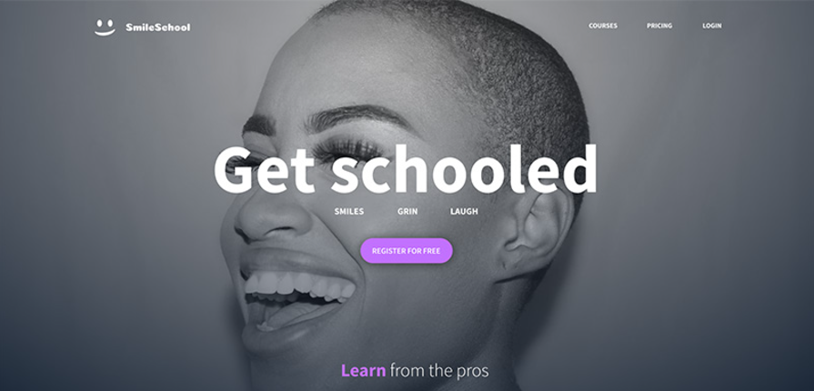

# CSS ADVANCED

## Overview

The "Smile School" project involves accurately replicating a given [Figma](https://www.figma.com/file/XrEAsu1vQj5fhVaNG38d2W/Homepage?node-id=0%3A1&mode=dev) design using **HTML5** and **CSS3**. The goal is to develop a deep understanding of advanced CSS properties and positioning techniques to precisely apply the visual design. No CSS frameworks are used, focusing on manual skills and accuracy in adhering to the original Figma design. This project demonstrates the ability to translate a visual design into a functional web product. You can see to web site [here](https://mathieumorel62.github.io/holbertonschool-web-development/css_advanced/)

## Resources

- [Some pointers about CSS](https://intranet.hbtn.io/concepts/840)
- [CSS fundamentals](https://intranet.hbtn.io/concepts/841)
- [CSS advanced](https://intranet.hbtn.io/concepts/847)
- [Learn to Code HTML & CSS (until “Creating Lists” included)](https://learn.shayhowe.com/html-css/)
- [Inline Styles in HTML](https://www.codecademy.com/article/html-inline-styles)
- [Specifics on CSS Specificity](https://css-tricks.com/specifics-on-css-specificity/)
- [CSS SpeciFishity](http://www.standardista.com/cgi-sys/suspendedpage.cgi)
- [CSS](https://developer.mozilla.org/en-US/docs/Learn/CSS)
- [MDN](https://developer.mozilla.org/en-US/)

## Languages

The languages used for this project are:

- HTML5
- CSS3

## Features

- `Header`: Contains the website's logo and a navigation bar with links to different sections such as courses, pricing, and login.

- `Banner`: A welcoming section with a large main image, the slogan "Get schooled", and a button inviting users to sign up for free.

- `Pro Section`: Highlights professional tutors with their portraits and accolades, offering a human touch and building trust with visitors.

- `Quote Section`: Features a testimonial from a satisfied user, adding social proof and personal endorsement of the site's offerings.

- `Video Section`: Displays a gallery of popular tutorials with attractive thumbnails, titles, and brief descriptions, inviting user interaction.

- `Membership Section`: Promotes free membership with a clear call-to-action button, encouraging users to join the community.

- `FAQ Section`: Provides answers to frequently asked questions in a clean and organized layout, helping to reduce any friction in the user's journey.

- `Footer`: Contains links to social media and copyright information, offering additional ways for users to connect with SmileSchool.

## Visuals

